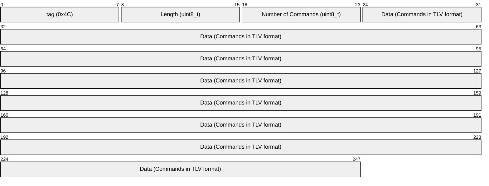

# Payload Format of tag XL

### Message Types

| Port | Name                                                                   |   Type   | Description                                                                                                           |
|------|------------------------------------------------------------------------|----------|-----------------------------------------------------------------------------------------------------------------------|
| 151  | [Settings Downlink](#setting-downlink)                                 | Downlink | Contains a list of setter, getter and/or runner commands.                                                             |
| 151  | [Settings Uplink](#setting-uplink)                                     | Uplink   | Contains a list of device and/or runner settings. Sent in different situations.                                       |
| 192  | [GNSS-NG Localization Message Steady](#gnss-message-format)   | Uplink   | One or two GNSS-NG localization messages are sent after a successful GNSS-NG scan. When device steady messages      |
| 193  | [GNSS-NG Localization Message Moving](#gnss-message-format)                  | Uplink   | A single Wi-Fi localization message is sent after a successful Wi-Fi scan. When device moving messages    |
| 194  | [GNSS-NG Localization Message Steady with Timestamp](#gnss-message-format-with-timestamp)   | Uplink   | A single Wi-Fi localization message is sent after a successful Wi-Fi scan. When device moving messages and timestamp.       |
| 195  | [GNSS-NG Localization Message Moving with Timestamp](#gnss-message-format-with-timestamp)   | Uplink   | A single Wi-Fi localization message is sent after a successful Wi-Fi scan. Device moving messages and timestamp |
| 197  | [Wi-Fi Localization Message Steady](#wi-fi-message-format)                      | Uplink   | A single Wi-Fi localization message is sent after a successful Wi-Fi scan. When device steady messages.                |
| 198  | [Wi-Fi Localization Message Moving](#wi-fi-message-format)                     | Uplink   | A single Wi-Fi localization message is sent after a successful Wi-Fi scan. When device moving messages.                |
| 200  | [Wi-Fi Localization Message Steady with Timestamp](#wi-fi-message-format-with-timestamp)       | Uplink   | A single Wi-Fi localization message is sent after a successful Wi-Fi scan. When device steady messages and timestamp.       |
| 201  | [Wi-Fi Localization Message Moving with Timestamp](#wi-fi-message-format-with-timestamp)       | Uplink   | A single Wi-Fi localization message is sent after a successful Wi-Fi scan. When device moving messages and timestamp.       |

### Configurable Parameters

The following table lists the default values and limits of the configurable parameters.
The parameters are modifiable via settings downlinks.

| Configuration Name         | Default Value | Minimum | Maximum     | Unit                       | Description                                                                                                                        |
|----------------------------|---------------|---------|-------------|----------------------------|------------------------------------------------------------------------------------------------------------------------------------|
| MOVING_INTERVAL            | 300           | 120     | 65535       | seconds                    | Localization scan interval if the device is in motion.                                                                             |
| STEADY_INTERVAL            | 7200          | 120     | 65535       | seconds                    | Localization scan interval if the device is **not** in motion.                                                                     |
| HEARTBEAT_INTERVAL         | 6             | 1       | 255         | hours                      | Heartbeat message interval.                                                                                                        |
| BLE_FWU_ENABLED            | 1             | 0       | 1           | -                          | BLE firmware update over the air enabled.                                                                                          |
| ADVERTISEMENT_FWU_INTERVAL | 30            | 5       | 255         | seconds                    | Time period during which the device opens the BLE advertisement for firmware updates.                                              |
| GNSS_ENABLE                | 1             | 0       | 1           | -                          | GNSS scans enabled.                                                                                                                |
| WIFI_ENABLE                | 1             | 0       | 1           | -                          | Wi-Fi scans enabled.                                                                                                               |
| ACCELERATION_ENABLE        | 1             | 0       | 1           | -                          | If enabled, localization scans are triggered if the device is in motion (based on the acceleration sensor data).                   |
| ACCELERATION_SENSITIVITY   | 300           | 0       | 16000       | milli-g                    | Acceleration sensor threshold.                                                                                                     |
| ACCELERATION_DELAY         | 1500          | 1000    | 65535       | milliseconds               | The device must remain in motion for at least the specified time to trigger a localization scan.                                   |

## Uplinks

### Settings Uplink

A settings uplink is sent on port 151.
The payload uses the TLV format (tag Length Value).
It is defined as: 

| tag  | Length                    | Number of Commands           | Data                   |
|------|---------------------------|------------------------------|------------------------|
| 0x4C | Variable number (uint8_t) | Variable number (uint8_t)    | Commands in TLV format |

The settings uplink contains one or more settings in its data section.
These settings are again in TLV format and are either device or runner settings:

|  # | Device Setting                   | tag  | Size | Data                                                                                                                     | Format      |
|----|----------------------------------|------|------|--------------------------------------------------------------------------------------------------------------------------|-------------|
|  1 | Device Flags                     | 0x40 | 0x01 | bit 0: BLE_FWU_ENABLED bit 1: GNSS_ENABLE bit 2: WIFI_ENABLE bit 3: ACCELERATION_ENABLE bit 4-7: RFU     | bit field   |
|  2 | Asset Tracking Intervals         | 0x41 | 0x04 | data 0: MOVING_INTERVAL data 1: STEADY_INTERVAL                                                                      | uint16_t[2] |
|  3 | Acceleration Sensor Settings     | 0x42 | 0x04 | data 0: ACCELERATION_SENSITIVITY data 1: ACCELERATION_DELAY                                                          | uint16_t[2] |
|  4 | HEARTBEAT_INTERVAL               | 0x43 | 0x01 | Heartbeat interval in hours                                                                                              | uint8_t     |
|  5 | ADVERTISEMENT_FWU_INTERVAL       | 0x44 | 0x01 | Value in seconds                                                                                                         | uint8_t     |
|  6 | Battery Voltage                  | 0x45 | 0x02 | Battery voltage in mV                                                                                                    | uint16_t    |
|  7 | Firmware Hash                    | 0x46 | 0x04 | First 4 bytes of SHA-1 hash of git commit                                                                                | uint8_t[4]  |
|  8 | Reset Count                      | 0x49 | 0x02 | Number of resets since last flash erase                                                                                  | uint16_t    |
|  9 | Reset Cause                      | 0x4A | 0x04 | Value of reset cause register                                                                                            | uint32_t    |
| 10 | Scan Counts                      | 0x4B | 0x04 | data 0: Number of GNSS scans since last reset data 1: Number of Wi-Fi scans since last reset                         | uint16_t[2] |

| # | Runner Setting                   | tag  | Size | Data                                                                                                                            | Format     |
|---|----------------------------------|------|------|---------------------------------------------------------------------------------------------------------------------------------|------------|
| 1 | Alarm Started                    | 0x80 | 0x02 | data 0: Duration of started alarm in minutes (min: 0, max: 255) data 1: Period of alarm beeps in seconds (min: 0, max: 255) | uint8_t[2] |
| 2 | Location Scan Triggered          | 0x82 | 0x00 | No payload data. A location scan runner command was received and a location scan was started if this tag is present.            | -          |

### GNSS-NG Localization Message

GNSS-NG localization messages are sent on port 192.
These messages are sent after a successful GNSS scan and they are generated by Semtech's geolocation service.
The device decides by itself whether it starts an autonomous GNSS scan or an assisted GNSS scan.
Before the device is able to perform an assisted GNSS scan, it must have a valid assistance position.

The device obtains an assistance position by performing an autonomous GNSS scan.
Afterwards, it locally demodulates time and computes an assistance position.
After an autonomous GNSS scan, the device sends a single GNSS-NG message.
As soon as the device has a valid assistance position, it performs assisted GNSS scans whenever possible.
The device is configured in MOBILE mode, which means it performs 2 GNSS scans with no delay between them.
After an assisted GNSS scan, the device sends either one or two GNSS-NG messages, depending on whether one or both scans were successful.
If a GNSS scan fails, the device does not send any GNSS-NG messages and starts a Wi-Fi scan instead.

The GNSS-NG messages are forwarded the LoRaCloud solver which computes the final position.
The multiframe feature of the LoRaCloud solver is used to combine the results of the two GNSS scans into a single position if two GNSS-NG messages are sent after an assisted GNSS scan.

Please refer to the section
[GNSS scan & send services](https://github.com/Lora-net/SWL2001/blob/v4.5.0/lbm_lib/smtc_modem_core/geolocation_services/README.md#2-gnss-scan--send-services)
of the README of Semtech's geolocation services for more information.
A detailed description of the LoRa Edge GNSS-NG (NAV-Group) positioning protocol is available
[here](https://www.loracloud.com/documentation/modem_services?url=mdmsvc.html#modem-service-protocol-payloads).

### New payload formats tag XL v3.2.0
With this firmware update, there has been a differentiation between ports 192, 193, 194, and 195.

|   Port:                      |   192  |   193  |   194  |   195  |
|------------------------------|--------|--------|--------|--------|
| Message sent when device is: | Steady | Moving | Steady | Moving |
| Timestamps:                  |   No   |   No   |   Yes  |   Yes  |

### GNSS message format 
For port 192: Steady; port 193: Moving

|  Byte Lenght |   1  |  Variable Lenght  |
|--------------|------|-------------------|
|  Field:      | GHDR |   U-GNSSLOC-NAV   |

GHDR: (Group Header)
|  Bits  |  7  |   6-5    |   4-0    |
|--------|-----|----------|----------|
| Field: | EOG | RFU=0b00 | GRP_TOKEN|

EOG: End of Group Flag. When set to 1, the device indicates that the NAV-messages of the group should be evaluated to a position.

RFU: Reserved for future use. Must be set to 0b00.

GRP_TOKEN: The group token is a 5-bit unsigned integer ranging from 2 to 31 (including). Values 0 and 1 are not allowed. Upon reset, the first value of the group token must be chosen as a random value between 2 and 31 (including) and is incremented by 1 for each new group thereafter. Group token 31 is followed by 2. Subsequent messages with a constant group token value are associated to the same group.

### GNSS message format with timestamp
For port 194: Steady; port 195: Moving

|  Byte Lenght |        4       |   1  |  Variable Lenght  |
|--------------|----------------|------|-------------------|
|  Field:      | Unix timestamp | GHDR |   U-GNSSLOC-NAV   |

Unix timestamp (4-byte seconds, big-endian)

GHDR: (Group Header)
|  Bits  |  7  |   6-5    |   4-0    |
|--------|-----|----------|----------|
| Field: | EOG | RFU=0b00 | GRP_TOKEN|

EOG: End of Group Flag. When set to 1, the device indicates that the NAV-messages of the group should be evaluated to a position.

RFU: Reserved for future use. Must be set to 0b00.

GRP_TOKEN: The group token is a 5-bit unsigned integer ranging from 2 to 31 (including). Values 0 and 1 are not allowed. Upon reset, the first value of the group token must be chosen as a random value between 2 and 31 (including) and is incremented by 1 for each new group thereafter. Group token 31 is followed by 2. Subsequent messages with a constant group token value are associated to the same group.

### Wi-Fi Localization Message

A Wi-Fi localization message is sent on port 197.
This message is sent after a successful Wi-Fi scan and it is generated by the Semtech's geolocation service.
The scan simply returns the list of access point MAC addresses that have been detected and sends it to the LoRaCloud solver within one uplink message.

Whenever a location scan is triggered, the device first performs a GNSS scan.
If the GNSS scan is successful, the device sends one or two GNSS-NG messages.
If the GNSS scan is not successful, the device performs a Wi-Fi scan.

Please refer to the section
[Wi-Fi scan & send services](https://github.com/Lora-net/SWL2001/blob/v4.5.0/lbm_lib/smtc_modem_core/geolocation_services/README.md#4-wi-fi-scan--send-services)
of the README of Semtech's geolocation services for more information.
A detailed description of the LoRa Edge Wi-Fi positioning protocol is available
[here](https://www.loracloud.com/documentation/modem_services?url=mdmsvc.html#modem-service-protocol-payloads).

### New payload formats tag XL v3.2.0
With this firmware update, there has been a differentiation between ports 197, 198, 200, and 201.

|   Port:                      |   197  |   198  |   200  |   201  |
|------------------------------|--------|--------|--------|--------|
| Message sent when device is: | Steady | Moving | Steady | Moving |
| Timestamps:                  |   No   |   No   |   Yes  |   Yes  |

### Wi-Fi message format

In addition, the Wi-Fi Messaging supports legacy for older firmware versions, but for TAG=0x00 (MACs only) remains valid (old format). New Wi-Fi uses TAG=0x01 with RSSI + MAC tuples.

For port 197: Steady; port 198: Moving

|  Byte Lenght |     1    |   1  |  6  |     |   1  |  6  |
|--------------|----------|------|-----|-----|------|-----|
|  Field:      |TAG = 0x01| RSSI | MAC | ... | RSSI | MAC |

### Wi-Fi message format with timestamp
For port 200: Steady; port 201: Moving
|  Byte Lenght |        4       |      1     |   1  |  6  |     |   1  |  6  |
|--------------|----------------|------------|------|-----|-----|------|-----|
|  Field:      | Unix timestamp | TAG = 0x01 | RSSI | MAC | ... | RSSI | MAC |

Unix timestamp (4-byte seconds, big-endian)

### Message Usage

#### Welcome Messages

A welcome message is sent every time the device successfully joined to a LoRaWAN network.
It corresponds to a settings uplink for the tags `[0x40, 0x41, 0x42, 0x43, 0x44, 0x45, 0x46, 0x49, 0x4A]`.
Therefore, it contains all settings of the device in addition to the battery voltage, the firmware hash, the reset count and the reset cause.

#### Heartbeat Messages

A heartbeat message is sent at a fixed interval.
The HEARTBEAT_INTERVAL is stored in the settings.
A heartbeat message corresponds to a settings uplink for the tags `[0x45, 0x4B]`.
Therefore, it contains the battery voltage and the scan counts.
If the HEARTBEAT_INTERVAL is adjusted via a settings downlink, a heartbeat message is sent after a short delay and the new interval is used for the next heartbeat message.

#### Settings Messages

For every received setting downlink, the device takes the actions for the received commands and sends a settings uplink.
The actions are summarized in the following list:

- Setter command: Is used to change the value of a setting. First, the range of the value is checked. If the value is in the valid range, it is stored in NVM. The current value of the setting is added to the settings uplink.
- Getter command: Is used to read the value of a setting. The current value of the setting is added to the settings uplink.
- Runner command: Is used to execute an action with the given runner settings. Some runner commands trigger a settings uplink.

The settings uplink uses the same order of settings as the commands of the downlink that it received before.
For example, if the received downlink contains the commands with tags `[0x22, 0x20, 0x44, 0x80]`, the uplink will contain the settings with tags `[0x42, 0x40, 0x44, 0x80]`.
The value of the settings correspond to the value of the **applied** settings.
If one of the commands in the downlink tried to set a setting to a value out of range, the corresponding setting will not be changed.
Hence, the settings uplink will contain the last value that was applied successfully instead of the value that was requested by the downlink.

#### Settings Messages with Alarm Command

If a setting downlink contains the alarm runner command `0x80` an alarm with the specified duration and interval is started.
The parameters are stored in RAM, not in NVM. The device exits the alarm mode after the specified duration has elapsed.
A running alarm is stopped if an alarm downlink is received with either duration or interval set to 0 (or both).
As for other settings downlinks, the device sends a settings uplink after a downlink with an alarm runner command.
The uplink confirms the duration and interval that were used to start or stop the alarm.

## Downlinks

### Settings Downlink

A settings downlink is sent on port 151.
The payload uses the TLV format (tag Length Value).
It is defined as: 

| tag  | Length                    | Number of Commands           | Data                   |
|------|---------------------------|------------------------------|------------------------|
| 0x4C | Variable number (uint8_t) | Variable number (uint8_t)    | Commands in TLV format |

The settings downlink contains one or more commands in its data section.
These commands are again in TLV format and are either setter, getter or runner commands:

| # | Setter Command                   | tag  | Size | Data                                                                                                                     | Format      |
|---|----------------------------------|------|------|--------------------------------------------------------------------------------------------------------------------------|-------------|
| 1 | Set Device Flags                 | 0x20 | 0x01 | bit 0: BLE_FWU_ENABLED bit 1: GNSS_ENABLE bit 2: WIFI_ENABLE bit 3: ACCELERATION_ENABLE bit 4-7: RFU     | bit field   |
| 2 | Set Asset Tracking Intervals     | 0x21 | 0x04 | data 0: MOVING_INTERVAL data 1: STEADY_INTERVAL                                                                      | uint16_t[2] |
| 3 | Set Acceleration Sensor Settings | 0x22 | 0x04 | data 0: ACCELERATION_SENSITIVITY data 1: ACCELERATION_DELAY                                                          | uint16_t[2] |
| 4 | Set HEARTBEAT_INTERVAL           | 0x23 | 0x01 | Heartbeat interval in hours                                                                                              | uint8_t     |
| 5 | Set ADVERTISEMENT_FWU_INTERVAL   | 0x24 | 0x01 | Value in seconds                                                                                                         | uint8_t     |
| 6 | Set DATE_RATE   | 0x28 | 0x01 | 000: DR5 (EU868 SF7)  001: DR4 (EU868 SF8) 010: DR3 (EU868 SF9, US915 SF7) 011: DR2 (EU868 SF10, US915 SF8) 100: DR1 (EU868 SF11, US915 SF9) 101: DR0 (EU868 SF12) 110: DR1-3 array (EU868 SF9-11, US915 SF7-9)  111: ADR (SF7-12) for EU868| uint8_t|

|  # | Getter Command                   | tag  | Size | Data | Format |
|----|----------------------------------|------|------|------|--------|
|  1 | Get Device Flags                 | 0x40 | 0x00 | -    | -      |
|  2 | Get Asset Tracking Intervals     | 0x41 | 0x00 | -    | -      |
|  3 | Get Acceleration Sensor Settings | 0x42 | 0x00 | -    | -      |
|  4 | Get HEARTBEAT_INTERVAL           | 0x43 | 0x00 | -    | -      |
|  5 | Get ADVERTISEMENT_FWU_INTERVAL   | 0x44 | 0x00 | -    | -      |
|  6 | Get Battery Voltage              | 0x45 | 0x00 | -    | -      |
|  7 | Get Firmware Hash                | 0x46 | 0x00 | -    | -      |
|  8 | Get Reset Count                  | 0x49 | 0x00 | -    | -      |
|  9 | Get Reset Cause                  | 0x4A | 0x00 | -    | -      |
| 10 | Get Scan Counts                  | 0x4B | 0x00 | -    | -      |
| 11 | Get ADR Settings                 | 0x4E | 0x00 | -    | -      |

| # | Runner Command                   | tag  | Size | Data / Description                                                                                                      | Format     |
|---|----------------------------------|------|------|-------------------------------------------------------------------------------------------------------------------------|------------|
| 1 | Run Alarm                        | 0x80 | 0x02 | data 0: Duration of alarm in minutes (min: 0, max: 255) data 1: Period of alarm beeps in seconds (min: 0, max: 255) | uint8_t[2] |
| 2 | Reset Device                     | 0x81 | 0x00 | Triggers a system reset on the device                                                                                   | -          |
| 3 | Run Location Scan                | 0x82 | 0x00 | Triggers a location scan on the device                                                                                  | -          |
| 4 | Clear Store and Forward Buffer   | 0x83 | 0x00 | Clears the message buffer used by the store and forward service of the LBM stack                                        | -          |

  

:::warning Support 
  
For support, please submit a ticket. We will provide support as promptly as possible.   
  

[**Click here to open a new ticket**](https://truvami.com/service-request/)
