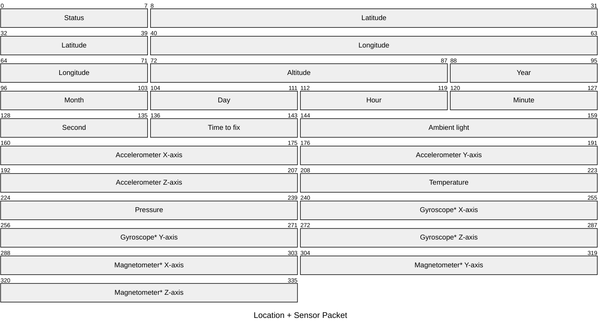
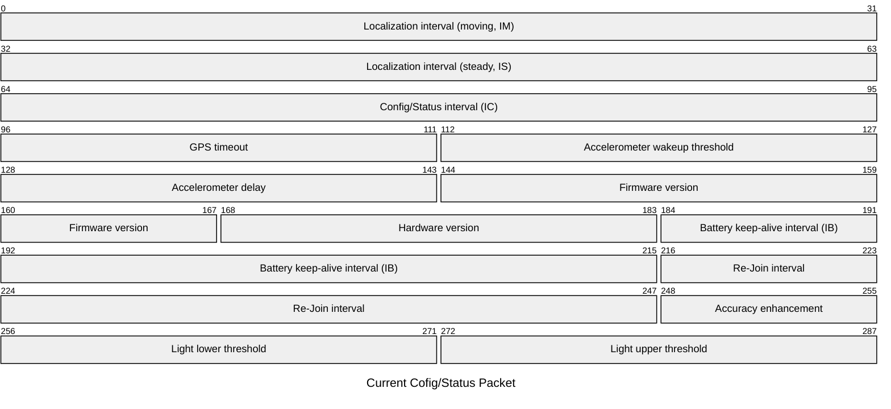
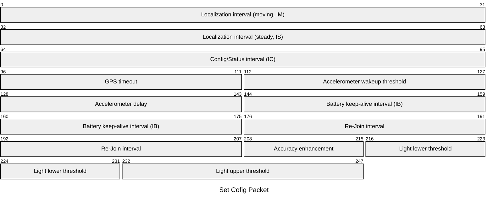

# Payload Format of nomad XS
Payloads are using big endian data encoding; Signed integers use two’s complement for encoding.

  
## Uplinks
  

### Location + Sensor (Uplink, Port 1)

| Byte  | Size | Description                               | Format                 |
|-------|------|-------------------------------------------|------------------------|
| 0     | 1    | Status[6:2] + Moving flag[0] (moving = 1) | uint8                  |
| 1-4   | 4    | Latitude                                  | int32, 1/1’000’000 deg |
| 5-8   | 4    | Longitude                                 | int32, 1/1’000’000 deg |
| 9-10  | 2    | Altitude                                  | uint16, 1/10 meter    |
| 11    | 1    | Year                                      | uint8, year after 2000 |
| 12    | 1    | Month                                     | uint8, [1..12]         |
| 13    | 1    | Day                                       | uint8, [1..31]         |
| 14    | 1    | Hour                                      | [1..23]                |
| 15    | 1    | Minute                                    | [1..59]                |
| 16    | 1    | Second                                    | [1..59]                |
| 17    | 1    | Time to fix                               | uint8, second(s)       |
| 18-19 | 2    | Ambient light                             | uint16, Lux            |
| 20-21 | 2    | Accelerometer X-axis                      | int16, mg              |
| 22-23 | 2    | Accelerometer Y-axis                      | int16, mg              |
| 24-25 | 2    | Accelerometer Z-axis                      | int16, mg              |
| 26-27 | 2    | Temperature                               | int16, 0.01 °C         |
| 28-29 | 2    | Pressure                                  | uint16, 0.1 hPa        |
| 30-31 | 2    | Gyroscope* X-axis                         | int16, 0.1 dps         |
| 32-33 | 2    | Gyroscope* Y-axis                         | int16, 0.1 dps         |
| 34-35 | 2    | Gyroscope* Z-axis                         | int16, 0.1 dps         |
| 36-37 | 2    | Magnetometer* X-axis                      | int16, mgauss          |
| 38-39 | 2    | Magnetometer* Y-axis                      | int16, mgauss          |
| 40-41 | 2    | Magnetometer* Z-axis                      | int16, mgauss          |

*Optional sensors

### Battery Pack (Uplink, Port 15)

| Byte  | Size | Description                                 | Format      |
|-------|------|---------------------------------------------|-------------|
| 0     | 1    | Status[6:2] + Low battery flag[0] (low = 1)               | uint8       |
| 1-2     | 2    | Battery voltage            | uint16, mV       |

### Status[6:2]

Status is only sent after a Config Downlink as an acknowledgement in the next Uplink.
4 bit [6:3] conf_change_id plus 1 bit [2] for success (=1) or failure (=0).
conf_change_id counter resets after reaching 15 (1111).

### Current Cofig/Status Packet (Uplink, Port 4)

| Byte  | Size | Description                               | Format           |
|-------|------|-------------------------------------------|------------------|
| 0-3   | 4    | Localization interval while moving, IM    | uint32, s        |
| 4-7   | 4    | Localization interval while steady, IS    | uint32, s        |
| 8-11  | 4    | Config/Status interval, IC                | uint32, s        |
| 12-13 | 2    | GPS timeout while waiting for fix         | uint16, s        |
| 14-15 | 2    | Accelerometer wakeup threshold            | uint16, mg       |
| 16-17 | 2    | Accelerometer delay                       | uint16, ms       |
| 18-20 | 3    | Firmware version (major,;minor; patch)    | 3 x uint8        |
| 21-22 | 2    | Hardware version (type; revision)         | 2 x uint8        |
| 23-26 | 4    | Battery “keep-alive” message interval, IB | uint32, s        |
| 27-30 | 4    | Re-Join interval in case of Join Failed   | uint32, s        |
| 31    | 1    | Accuracy enhancement                      | uint8, s [0..59] |
| 32-33 | 2    | Light lower threshold                     | uint16, Lux           |
| 34-35 | 2    | Light upper threshold                     | uint16, Lux           |

*Optional sensors

  
## Downlinks
  

### Set Cofig Packet (Downlink, Port 128)

| Byte  | Size | Description                               | Format           |
|-------|------|-------------------------------------------|------------------|
| 0-3   | 4    | Localization interval while moving, IM    | unit32, s        |
| 4-7   | 4    | Localization interval while steady, IS    | unit32, s        |
| 8-11  | 4    | Config/Status interval, IC                | unit32, s        |
| 12-13 | 2    | GPS timeout while waiting for fix         | uint16, s        |
| 14-15 | 2    | Accelerometer wakeup threshold            | uint16, mg       |
| 16-17 | 2    | Accelerometer delay                       | uint16, ms       |
| 18-21 | 4    | Battery “keep-alive” message interval, IB | uint32, s        |
| 22-25 | 4    | Re-Join interval in case of Join Failed   | uint32, s        |
| 26    | 1    | Accuracy enhancement                      | uint8, s [0..59] |
| 27-28 | 2    | Light lower threshold                     | uint16, Lux      |
| 29-30 | 2    | Light upper threshold                     | uint16, Lux      |

### Flash Erase (Downlink, Port 129)

| Byte  | Size | Description                                 | Format      |
|-------|------|---------------------------------------------|-------------|
| 0     | 1    | Flash erase = 1               | uint8       |

### Off Packet (Downlink, Port 130)

| Byte  | Size | Description                                 | Format      |
|-------|------|---------------------------------------------|-------------|
| 0     | 1    | Power off = 0                 | uint8       |

  

:::warning Support 
  
For support, please submit a ticket. We will provide support as promptly as possible.   
   

[**Click here to open a new ticket**](https://truvami.com/service-request/)
