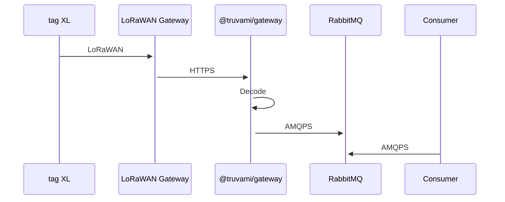

# Rabbit MQ Forwarding - truvami Gateway Service: Deep Dive 

The truvami Gateway Service parses incoming messages from tag XL devices and subsequently forward them to designated outputs. As of now, Rabbit MQ is the singular supported destination for this service.

The service communicates via three distinct types of payloads, referred to as Position Uplink, Status Uplink, and Configuration Uplink, each carrying specific data to the device operation.



## Detailed Payload Information

1. **Position Uplink**: This payload includes geographic location data for the tag XL device, essential for tracking and auditing physical whereabouts of the equipment.

2. **Status Uplink**: A payload type catering specifically to rotational use-cases, the status uplink carries crucial device status information.

3. **Configuration Uplink**: An essential package of critical configuration parameters, which include details on, but not limited to, the remaining battery life. 

## Setting up Message Forwarding

Rabbit MQ message forwarding for your tag XL devices necessitates you to configure the Rabbit MQ output in detail. The truvami Gateway Service is engineered to sort incoming messages into distinct queues based on the type of the payload. 

For each of the three payloads - Position, Status and Configuration - the service establishes a distinct queue to store and handle the related message data. Please ensure your Rabbit MQ is set-up to align with this specialized flow of data. 

### Position Uplink Message Forwarding

Position Uplink messages are redirected to a specially configured 'position-queue'. Rabbit MQ should be setup to keep an eye out for messages coming down this line and process them accordingly. 

### Status Uplink Message Forwarding 

In an identical manner, Status Uplink messages find their way into a 'status-queue'.

Your Rabbit MQ should be set to identify and process Status Uplink messages coming down based on values that have been set.

### Configuration Uplink Message Forwarding

Lastly, Configuration Uplink messages are channeled into a 'config-queue'. These messages carry important configuration updates emanating from your tag XL devices, including battery status and active configuration parameters. Not every message will contain all configuration parameters, so it is important to ensure that your Rabbit MQ is set to handle these messages with care.

## Payload Specifics

#### Position Uplink Payload:

This packet of data carries the most up-to-date geographical location details related to your tag XL device, encapsulating essentials such as longitude, latitude, altitude (if available), source, accuracy of the position, and number of position fixes included in the uplink.

| Field         | Type     | Description                                      |
| ------------- | -------- | ------------------------------------------------ |
| `dev_eui`     | `string` | Device EUI identifier                            |
| `timestamp`   | `string` | Timestamp of the position uplink event           |
| `captured_at` | `string` | Timestamp of when the message was captured       |
| `longitude`   | `number` | Longitude of the device's position               |
| `latitude`    | `number` | Latitude of the device's position                |
| `altitude`    | `number` | Altitude of the device's position (if available) |
| `source`      | `string` | Source of the position estimation                |
| `accuracy`    | `number` | Accuracy of the position estimation              |
| `count`       | `number` | Number of position fixes included in the uplink  |

Below is an illustrative example of what a typical Position Uplink payload might look like:

```json
{
    "dev_eui": "10CE45FFFE00ABC2",
    "timestamp": "2024-07-24T08:10:46+02:00",
    "captured_at": "2024-07-24T08:10:46+02:00",
    "longitude": 8.23378,
    "latitude": 47.26066,
    "source": "gnssg",
    "accuracy": 21.5,
    "count": 1
}
```

#### Status Uplink Payload:

The Status Uplink payload carries data about the last recorded state of the device, the new state, number of rotations performed (incase of rotational devices), elapsed seconds since the last state change, and the number of status uplink events. Possible states include 'UNDEFINED', 'POURING' and 'MIXING'.

| Field                 | Type     | Description                                            |
| --------------------- | -------- | ------------------------------------------------------ |
| `dev_eui`             | `string` | Device EUI identifier                                  |
| `timestamp`           | `string` | Timestamp of the status uplink event                   |
| `captured_at`         | `string` | Timestamp of when the message was captured             |
| `last_state`          | `string` | Last known state of the device                         |
| `new_state`           | `string` | Current state of the device                            |
| `number_of_rotations` | `number` | Number of rotations performed (for rotation use case)  |
| `elapsed_seconds`     | `number` | Elapsed seconds since the last state change            |
| `count`               | `number` | Number of status uplink events included in the payload |

Below is a snapshot of what a typical Status Uplink payload might constitute:

```json
{
    "dev_eui": "10CE45FFFE00ABC2",
    "timestamp": "2024-07-24T08:10:46+02:00",
    "captured_at": "2024-07-24T08:10:46+02:00",
    "last_state": "UNDEFINED",
    "new_state": "POURING",
    "number_of_rotations": 0,
    "elapsed_seconds": 120,
    "count": 1
}
```

#### Config Uplink Payload:

Configuration Uplink serves as a conduit carrying important system parameters. It contains data about the device's battery voltage and total count of status uplink events.

| Field         | Type     | Description                                            |
| ------------- | -------- | ------------------------------------------------------ |
| `dev_eui`     | `string` | Device EUI identifier                                  |
| `timestamp`   | `string` | Timestamp of the status uplink event                   |
| `captured_at` | `string` | Timestamp of when the message was captured             |
| `voltage`     | `number` | Battery voltage in volts (can be null)                 |
| `count`       | `number` | Number of status uplink events included in the payload |

Here's a glimpse into a standard Configuration Uplink payload:

```json
{
    "dev_eui": "10CE45FFFE00ABC2",
    "timestamp": "2024-07-24T08:10:46+02:00",
    "captured_at": "2024-07-24T08:10:46+02:00",
    "voltage": 3.6,
    "count": 1
}
```
