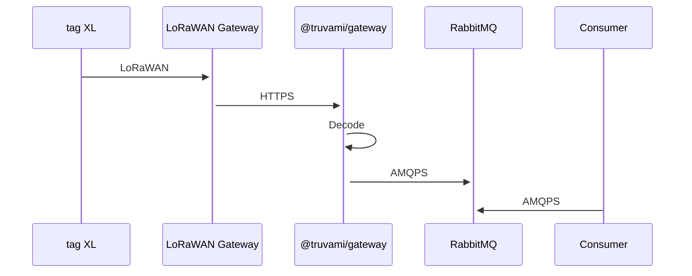

# forward - Rabbit MQ

The gateway service allows you to configure its services to forward incoming messages to a designated output. Currently, only Rabbit MQ is supported for tag XL devices. There are three different types of payloads that can be forwarded:



1. **Position Uplink**: Contains information related to device position.
2. **Status Uplink**: Specifically for a special rotation use case.
3. **Config Uplink**: Contains configuration information. (e.g battery level, etc.)

## Forwarding Configuration

To enable message forwarding for your tag XL devices, you will need to configure the Rabbit MQ output. The forwarded messages will be segregated into multiple queues based on the payload types.

### Position Uplink

Position Uplink messages will be forwarded to the following queues:

- **position-queue**: Queue for storing position uplink messages.

Please make sure to set up your Rabbit MQ configuration accordingly to receive and process the forwarded Position Uplink payloads.

### Status Uplink

Status Uplink messages will be forwarded to the following queues:

- **status-queue**: Queue for storing status uplink messages.

Please make sure to set up your Rabbit MQ configuration accordingly to receive and process the forwarded Status Uplink payloads.

### Battery Uplink

Battery Uplink messages will be forwarded to the following queues:

- **battery-queue**: Queue for storing battery uplink messages.

Please make sure to set up your Rabbit MQ configuration accordingly to receive and process the forwarded Battery Uplink payloads.

### Position Uplink Payload

| Field         | Type     | Description                                      |
| ------------- | -------- | ------------------------------------------------ |
| `dev_eui`     | `string` | Device EUI identifier                            |
| `timestamp`   | `string` | Timestamp of the position uplink event           |
| `captured_at` | `string` | Timestamp of when the message was captured       |
| `longitude`   | `number` | Longitude of the device's position               |
| `latitude`    | `number` | Latitude of the device's position                |
| `altitude`    | `number` | Altitude of the device's position (if available) |
| `source`      | `string` | Source of the position estimation                |
| `accuracy`    | `number` | Accuracy of the position estimation              |
| `count`       | `number` | Number of position fixes included in the uplink  |

```json
{
    "dev_eui": "10CE45FFFE00ABC2",
    "timestamp": "2024-07-24T08:10:46+02:00",
    "captured_at": "2024-07-24T08:10:46+02:00",
    "longitude": 8.23378,
    "latitude": 47.26066,
    "source": "gnssg",
    "accuracy": 21.5,
    "count": 1
}
```

Please make sure to set up your Rabbit MQ configuration accordingly to receive and process the forwarded Position Uplink payloads.

### Status Uplink Payload

| Field                 | Type     | Description                                            |
| --------------------- | -------- | ------------------------------------------------------ |
| `dev_eui`             | `string` | Device EUI identifier                                  |
| `timestamp`           | `string` | Timestamp of the status uplink event                   |
| `captured_at`         | `string` | Timestamp of when the message was captured             |
| `last_state`          | `string` | Last known state of the device                         |
| `new_state`           | `string` | Current state of the device                            |
| `number_of_rotations` | `number` | Number of rotations performed (for rotation use case)  |
| `elapsed_seconds`     | `number` | Elapsed seconds since the last state change            |
| `count`               | `number` | Number of status uplink events included in the payload |

```json
{
    "dev_eui": "10CE45FFFE00ABC2",
    "timestamp": "2024-07-24T08:10:46+02:00",
    "captured_at": "2024-07-24T08:10:46+02:00",
    "last_state": "UNDEFINED",
    "new_state": "POURING",
    "number_of_rotations": 0,
    "elapsed_seconds": 120,
    "count": 1
}
```

Please adjust your Rabbit MQ configuration settings to handle the forwarded Status Uplink payloads accordingly.

### Battery Uplink Payload

| Field         | Type     | Description                                            |
| ------------- | -------- | ------------------------------------------------------ |
| `dev_eui`     | `string` | Device EUI identifier                                  |
| `timestamp`   | `string` | Timestamp of the status uplink event                   |
| `captured_at` | `string` | Timestamp of when the message was captured             |
| `voltage`     | `number` | Battery voltage in volts                               |
| `count`       | `number` | Number of status uplink events included in the payload |

```json
{
    "dev_eui": "10CE45FFFE00ABC2",
    "timestamp": "2024-07-24T08:10:46+02:00",
    "captured_at": "2024-07-24T08:10:46+02:00",
    "voltage": 3.6,
    "count": 1
}
```

Please adjust your Rabbit MQ configuration settings to handle the forwarded Battery Uplink payloads accordingly.
