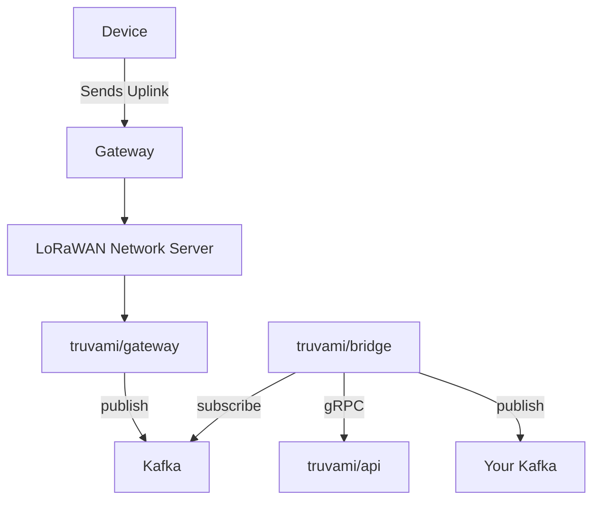

## Overview

Truvami supports forwarding decoded messages to your own Kafka cluster. All messages are serialized as **JSON**. Each Kafka message is wrapped using a consistent envelope format and includes a schema version number.

### Kafka Message Envelope

```json
{
  "data": {
    // message content (see below)
  },
  "version": 1
}
```

This allows forward compatibility with future schema versions.

---

## Message Types

### Uplink

Represents an uplink transmission from a device, including raw payload and radio metadata.

| Field           | Type      | Nullable | Description                                              |
| --------------- | --------- | -------- | -------------------------------------------------------- |
| uuid            | `string`  | No       | Unique identifier for the uplink                         |
| devEui          | `string`  | No       | Device EUI (unique identifier)                           |
| customer        | `string`  | Yes      | Customer ID                                              |
| payload         | `string`  | No       | Hex-encoded payload data                                 |
| port            | `number`  | No       | Port number used for the uplink                          |
| uplinkCounter   | `number`  | No       | Uplink counter for deduplication                         |
| downlinkCounter | `number`  | Yes      | Downlink counter for deduplication                       |
| consumedAirtime | `number`  | Yes      | Airtime consumed by the uplink                           |
| bestSnr         | `number`  | Yes      | Best Signal-to-Noise Ratio                               |
| worstSnr        | `number`  | Yes      | Worst Signal-to-Noise Ratio                              |
| averageSnr      | `number`  | Yes      | Average Signal-to-Noise Ratio                            |
| bestRssi        | `number`  | Yes      | Best Received Signal Strength Indicator                  |
| worstRssi       | `number`  | Yes      | Worst Received Signal Strength Indicator                 |
| averageRssi     | `number`  | Yes      | Average Received Signal Strength Indicator               |
| spreadingFactor | `number`  | No       | Spreading factor used for the uplink (SF7 - SF12)        |
| confirmed       | `boolean` | No       | Whether the uplink is confirmed                          |
| receivedAt      | `string`  | No       | Timestamp when the uplink was received (RFC 3339 format) |
| dutyCycle       | `boolean` | Yes      | Whether duty cycle is applied                            |

**Example:**

```json
{
  "data": {
    "uuid": "126cd4ea-4c15-4cd7-b2a0-9860b5088fc2",
    "devEui": "10CE45FFFE01xxxx",
    "customer": "126cd4ea-4c15-4cd7-b2a0-9860b5088fc2",
    "payload": "hex-string",
    "port": 1,
    "uplinkCounter": 123,
    "downlinkCounter": 12,
    "consumedAirtime": 0.56,
    "bestSnr": 10.2,
    "worstSnr": -3.4,
    "averageSnr": 5.3,
    "bestRssi": -45.0,
    "worstRssi": -105.0,
    "averageRssi": -78.6,
    "spreadingFactor": 12,
    "confirmed": true,
    "receivedAt": "2025-08-06T12:00:00Z",
    "dutyCycle": false
  },
  "version": 1
}
```

---

### Event

Describes a device-level event such as button press or reset.

| Field      | Type     | Nullable | Description                                             |
| ---------- | -------- | -------- | ------------------------------------------------------- |
| uuid       | `string` | No       | Unique identifier for the event                         |
| devEui     | `string` | No       | Device EUI (unique identifier)                          |
| type       | `number` | No       | Event type (see `EventType` enum below)                 |
| customer   | `string` | Yes      | Customer ID                                             |
| receivedAt | `string` | No       | Timestamp when the event was received (RFC 3339 format) |
| occurredAt | `string` | No       | Timestamp when the event occurred (RFC 3339 format)     |
| uplink     | `string` | No       | Uplink ID associated with the event                     |

**Example:**

```json
{
  "data": {
    "uuid": "126cd4ea-4c15-4cd7-b2a0-9860b5088fc2",
    "devEui": "10CE45FFFE01xxxx",
    "type": 7,
    "customer": "126cd4ea-4c15-4cd7-b2a0-9860b5088fc2",
    "receivedAt": "2025-07-29T15:12:25.243406716Z",
    "occurredAt": "2025-07-29T14:19:02Z",
    "uplink": "126cd4ea-4c15-4cd7-b2a0-9860b5088fc2"
  },
  "version": 1
}
```

#### `type` enum values (`EventType`)

| Value | Meaning                  |
| ----- | ------------------------ |
| 0     | `Unspecified`            |
| 1     | `ButtonPress`            |
| 2     | `ConfigChange`           |
| 3     | `ManualDeviceReset`      |
| 4     | `AutomaticDeviceReset`   |
| 5     | `DutyCycle`              |
| 6     | `FirmwareChange`         |
| 7     | `RotationStatePouring`   |
| 8     | `RotationStateMixing`    |
| 9     | `RotationStateError`     |
| 10    | `RotationStateUndefined` |

---

### RotationStatus

Describes a transition between rotation states (e.g., from mixing to pouring).

| Field          | Type     | Nullable | Description                                                       |
| -------------- | -------- | -------- | ----------------------------------------------------------------- |
| uuid           | `string` | No       | Unique identifier for the rotation status                         |
| devEui         | `string` | No       | Device EUI (unique identifier)                                    |
| customer       | `string` | Yes      | Customer ID                                                       |
| uplink         | `string` | No       | Uplink ID associated with the rotation status                     |
| lastState      | `number` | No       | Previous rotation state (see `RotationStatusType` enum below)     |
| newState       | `number` | No       | New rotation state (see `RotationStatusType` enum below)          |
| rotations      | `number` | Yes      | Number of rotations completed during the state transition         |
| elapsedSeconds | `number` | No       | Time elapsed during the state transition in seconds               |
| receivedAt     | `string` | No       | Timestamp when the rotation status was received (RFC 3339 format) |
| capturedAt     | `string` | No       | Timestamp when the rotation status was captured (RFC 3339 format) |
| sequenceNumber | `number` | No       | Sequence number for deduplication                                 |

**Example:**

```json
{
  "data": {
    "uuid": "126cd4ea-4c15-4cd7-b2a0-9860b5088fc2",
    "devEui": "10CE45FFFE01xxxx",
    "customer": "126cd4ea-4c15-4cd7-b2a0-9860b5088fc2",
    "uplink": "126cd4ea-4c15-4cd7-b2a0-9860b5088fc2",
    "lastState": 1,
    "newState": 2,
    "rotations": 2.5,
    "elapsedSeconds": 60,
    "receivedAt": "2025-08-06T12:00:00Z",
    "capturedAt": "2025-08-06T11:59:50Z",
    "sequenceNumber": 42
  },
  "version": 1
}
```

#### `lastState` / `newState` enum values (`RotationStatusType`)

| Value | Meaning     |
| ----- | ----------- |
| 0     | `undefined` |
| 1     | `pouring`   |
| 2     | `mixing`    |
| 3     | `error`     |

---

### Position

Provides location data captured by the device (GNSS, LoRa, Wi-Fi, BLE).

| Field       | Type      | Nullable | Description                                                |
| ----------- | --------- | -------- | ---------------------------------------------------------- |
| uuid        | `string`  | No       | Unique identifier for the position                         |
| devEui      | `string`  | No       | Device EUI (unique identifier)                             |
| customer    | `string`  | Yes      | Customer ID                                                |
| uplink      | `string`  | No       | Uplink ID associated with the position                     |
| latitude    | `number`  | No       | Latitude in decimal degrees                                |
| longitude   | `number`  | No       | Longitude in decimal degrees                               |
| altitude    | `number`  | Yes      | Altitude in meters                                         |
| accuracy    | `number`  | Yes      | Horizontal accuracy in meters                              |
| source      | `number`  | No       | Source of position data (see `PositionSource` enum below)  |
| moving      | `boolean` | Yes      | Whether the device is moving                               |
| buffered    | `boolean` | No       | Whether the position is buffered                           |
| bufferLevel | `number`  | Yes      | Buffer level indicating how full the buffer is             |
| receivedAt  | `string`  | No       | Timestamp when the position was received (RFC 3339 format) |
| capturedAt  | `string`  | No       | Timestamp when the position was captured (RFC 3339 format) |
| ttf         | `number`  | Yes      | Time to first fix in seconds                               |
| pdop        | `number`  | Yes      | Position Dilution of Precision (PDOP) value                |
| satellites  | `number`  | Yes      | Number of satellites used for the position fix             |

**Example:**

```json
{
  "data": {
    "uuid": "126cd4ea-4c15-4cd7-b2a0-9860b5088fc2",
    "devEui": "10CE45FFFE01xxxx",
    "customer": "126cd4ea-4c15-4cd7-b2a0-9860b5088fc2",
    "uplink": "126cd4ea-4c15-4cd7-b2a0-9860b5088fc2",
    "latitude": 4.13743,
    "longitude": 2.57549,
    "altitude": 520.5,
    "accuracy": 3.2,
    "source": 0,
    "moving": true,
    "buffered": false,
    "bufferLevel": 0,
    "receivedAt": "2025-08-06T12:00:00Z",
    "capturedAt": "2025-08-06T11:59:30Z",
    "ttf": 8,
    "pdop": 1.5,
    "satellites": 6
  },
  "version": 1
}
```

#### `source` enum values (`PositionSource`)

| Value | Meaning |
| ----- | ------- |
| 0     | `gnss`  |
| 1     | `lora`  |
| 2     | `wifi`  |
| 3     | `ble`   |

---

### BatteryStatus

Provides battery voltage readings.

| Field      | Type     | Nullable | Description                                                      |
| ---------- | -------- | -------- | ---------------------------------------------------------------- |
| uplink     | `string` | No       | Uplink ID associated with the battery status                     |
| devEui     | `string` | No       | Device EUI (unique identifier)                                   |
| customer   | `string` | Yes      | Customer ID                                                      |
| voltage    | `number` | No       | Battery voltage in volts                                         |
| receivedAt | `string` | No       | Timestamp when the battery status was received (RFC 3339 format) |
| capturedAt | `string` | No       | Timestamp when the battery status was captured (RFC 3339 format) |

**Example:**

```json
{
  "data": {
    "uplink": "126cd4ea-4c15-4cd7-b2a0-9860b5088fc2",
    "devEui": "10CE45FFFE01xxxx",
    "customer": "126cd4ea-4c15-4cd7-b2a0-9860b5088fc2",
    "voltage": 3.65,
    "receivedAt": "2025-08-06T12:00:00Z",
    "capturedAt": "2025-08-06T11:59:55Z"
  },
  "version": 1
}
```

---

## Additional Notes

- **Timestamps** use [RFC 3339](https://datatracker.ietf.org/doc/html/rfc3339) format and are in UTC.
- **Enum values** are serialized as integers.
- All messages are wrapped using the same envelope structure containing a `data` object and a `version` field.
